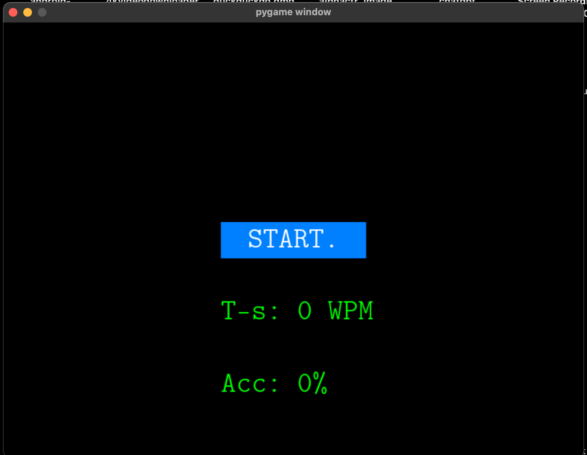

# typing_test
# Typing Game in Pygame
\\


\\

This is a simple typing game implemented in Pygame where you can practice your typing skills. The game loads text from a file, and your goal is to type the displayed text as accurately and quickly as possible.

## Table of Contents
- [Getting Started](#getting-started)
- [Directory Structure](#directory-structure)
- [Prerequisites](#prerequisites)
- [Installation](#installation)
- [Usage](#usage)
- [How to Play](#how-to-play)
- [Game Features](#game-features)
- [Contributing](#contributing)
- [License](#license)

## Getting Started

Follow the instructions below to get the game up and running on your local machine.

### Directory Structure

The project directory is structured as follows:

- **cmu**: This directory contains the font file used for rendering text in the game. It includes `.ttf` files.

- **sound**: Here, you'll find sound files used in the game, such as keyboard keypress sounds and error beep sounds.

- **typing_set**: This directory holds text files that contain various sentences and paragraphs you can type during the game.

- **main.py**: The main Python script (`main.py`) is the entry point for the game. It contains the game logic, including the game loop, user interface, and typing functionality.


### Prerequisites

- Python 3.x
- Pygame library

You can install Pygame using pip:

```bash
pip install -r requirements.txt
```

### Installation

1. Clone this repository to your local machine:

```bash
https://github.com/ganeshnikhil/typing_test.git
```

2. Navigate to the project directory:

```bash
cd typing_text
```

## Usage

To start the game, run the following command:

```bash
python main.py
```

## How to Play

1. When you run the game, you will see a "START" button on the screen.

2. Click the "START" button to begin a typing session.

3. The game will randomly select a piece of text from the provided text file.

4. Type the displayed text as accurately and quickly as possible.

5. If you make a mistake, the text will change color to indicate an error.

6. Once you've completed the text or want to stop, the game will show your typing speed (words per minute) and accuracy percentage.

7. You can start a new session by clicking the "START" button again.

## Game Features

- Randomly selected text for variety.
- Typing speed calculation (words per minute).
- Accuracy calculation (percentage).
- Sound effects for correct and incorrect typing.

## Contributing

Contributions are welcome! If you would like to contribute to the project, please follow these steps:

1. Fork the repository.
2. Create a new branch for your feature or bug fix.
3. Make your changes and commit them.
4. Push your changes to your fork.
5. Submit a pull request to the main repository.

## License

This project is licensed under the MIT License - see the [LICENSE](LICENSE) file for details.


## Functions in `main.py`

### `play_wav_file_with_no_lag(filename)`

Plays a WAV file with minimal lag using the `pygame.mixer` module.

- Args:
  - `filename`: The path to the WAV file.

### `render_button()`

Renders the start button on the screen at the beginning of the game.

- Returns:
  - `button_surface`: A Pygame surface object representing the button.
  - `button_rect`: A Pygame rectangle object representing the button's position and size.

### `text_pointer(coordinates)`

Draws a transparent rectangle at the given coordinates on the screen.

- Args:
  - `coordinates`: A Pygame rectangle object representing the coordinates.

### `manage_text_placing(text, max_width)`

Formats the text to fit the screen's width, wrapping it as necessary.

- Args:
  - `text`: The text to format.
  - `max_width`: The maximum width allowed for the text.

- Returns:
  - `rapped_word`: The formatted text.

### `text_render(text)`

Renders the text on the screen by breaking it into individual characters.

- Args:
  - `text`: The text to render.

### `render_on_screen(text_coordinates)`

Renders the typing text on the screen.

- Args:
  - `text_coordinates`: A list of text, rectangle, and letter data.

### `render_typing_speed(timer, text)`

Calculates and renders the typing speed on the screen.

- Args:
  - `timer`: The elapsed time since typing started.
  - `text`: The typed text.

### `render_accuracy(text, right_characters)`

Calculates and renders the typing accuracy on the screen.

- Args:
  - `text`: The original text.
  - `right_characters`: The count of correctly typed characters.

### `load_text_file(filepath)`

Loads the typing data from a text file.

- Args:
  - `filepath`: The path to the text file.

- Returns:
  - `lines`: A list of lines from the text file.

### Main Game Loop

The main game loop in `main.py` handles user input, text typing, and game state management. It initializes the game, listens for key presses, updates the screen, and calculates typing speed and accuracy.

### Installation and Gameplay

Refer to the installation and gameplay instructions provided above in the README for details on how to set up and play the Typing Game.

